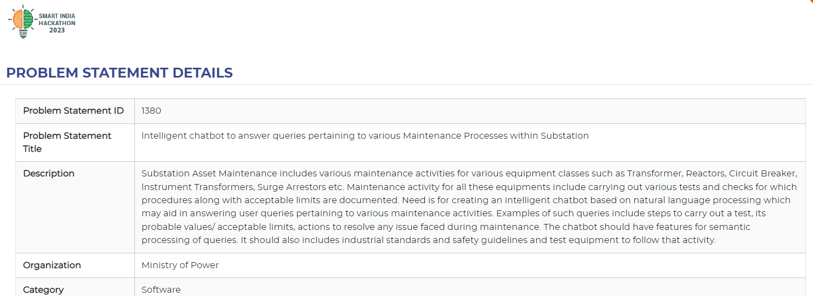

# Production-1
## Summer

The frontend part of this project is insipired from SIH(Smart India Hackathon) problem statement 

The backend is intended to be done using Flask.

The base idea is to build a chatbot which uses LangChain for integrating LLMS for better responses.

### Tech Stack

- HTML, CSS, JS, and ReactJS (if needed) for frontend
- Python-Flask for backend
- Database:  Conventional-(SQLite3)
              LLM-Vector Database(Chroma db )
- LLM-GEMINI FLASK 1.5 MODEL
